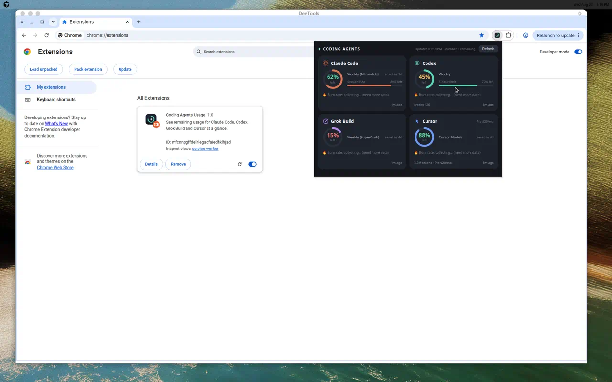

# coding-agent-usage-tracking

A Chrome (Manifest V3) browser extension that shows your remaining usage for
**Claude Code, Codex, Grok Build and Cursor** at a glance — in one popup.

Example popup with sample data.

## What it does

- One click shows the remaining weekly / short-term quota for all four agents, and when each one resets.
- Once it has a few hours of history, it estimates your burn rate and warns when you'll run out **before** the next reset. Each card also draws a 7-day sparkline of your remaining quota.
- The ⚙ button lets you pick which agents to track — unchecked ones are skipped by Refresh and hidden from the dashboard.
- If a refresh can't read a page (usually because you're signed out), the card says so and links straight to that product's usage page.
- No API and no account linking — it reads the numbers straight off each tool's own usage page that you're already logged into.
- Everything stays local in your browser (`chrome.storage.local`). Nothing is sent to any server.

## Install (load unpacked)

1. Open `chrome://extensions` in Chrome.
2. Turn on **Developer mode** (top-right).
3. Click **Load unpacked** and select this repository's folder.
4. Click the toolbar icon. The dashboard opens in the **side panel** so it stays visible while Refresh scrapes.
5. Click **Refresh** (or open a product's usage page in a normal tab) to populate the data.
6. The dashboard defaults to **English**. Click **中文** / **EN** in the header to switch; the choice is stored locally (`uiLang`) and does not follow Chrome's UI language.

## Files

- `manifest.json` — extension manifest (Manifest V3)
- `agents.js` — shared registry of the four agents (names, colors, usage-page URLs)
- `background.js` — service worker that coordinates the "Refresh" flow
- `content.js` — content script that reads usage numbers from each product page
- `popup.html` / `popup.js` / `i18n.js` — the side-panel dashboard (English / 中文)
- `_locales/` — Chrome Store / `chrome://extensions` name and description
- `icons/` — extension icons

## Development

The extension is zero-dependency vanilla JS. The only tooling is dev-time
helpers for validating and packaging it (installed with `npm install`).

- `npm run validate` — check the manifest is valid MV3 and every referenced script parses.
- `npm run build` — package the extension into `dist/coding_agents_usage-<version>.zip`.
- `npm start` — launch Chrome with the extension loaded for interactive testing (uses `web-ext run -t chromium`).

## Disclaimer

Unofficial and not affiliated with Anthropic, OpenAI, xAI, or Cursor. It only
reads usage numbers already shown on each product's own page.

---

Built by [Junjie Liu](https://www.linkedin.com/in/junjieliu/) at [Philosophie AI](https://philosophie.ai).
